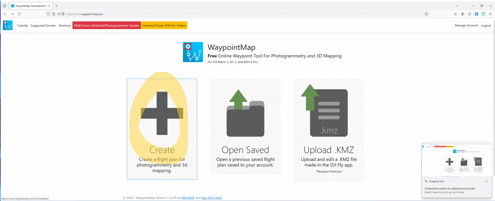
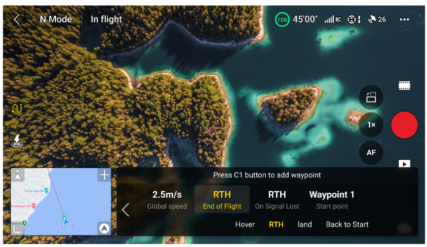
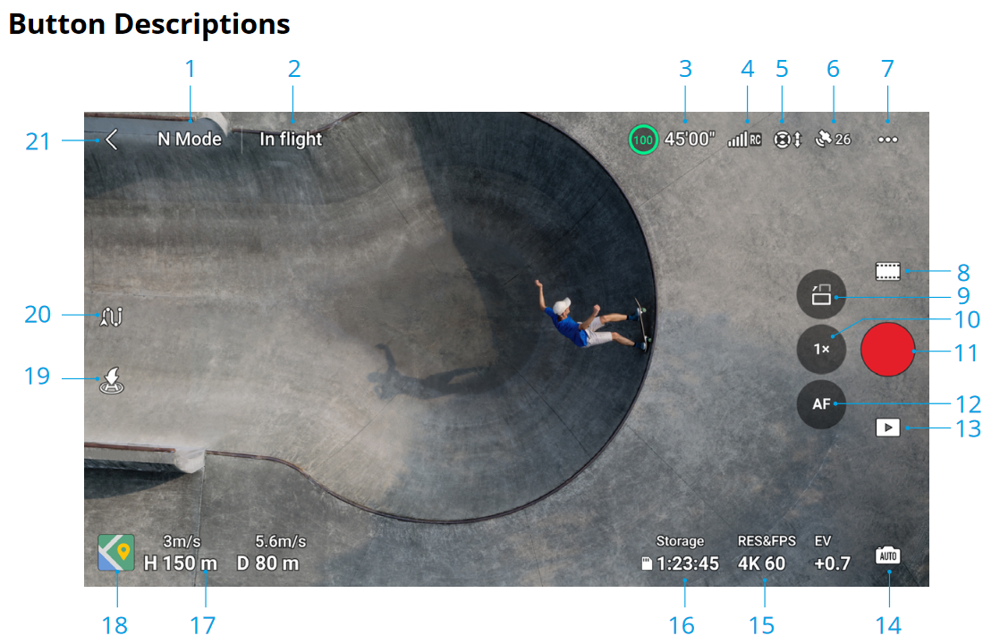

# DJI Flight Control

## Info

### Waypoint Feature

- In order to load a flight plan onto a DJI drone without their prioprietary software,
  the drone must support loading [Waypoints][1].
- It's a mixed bag which drones actually support this feature, with the Sep '23 Mini 4 Pro
  supporting and the May '22 Mini 3 Pro not supporting it.
- Generally the more expensive 'enterprise' drones will support this feature,
  while cheaper 'hobbyist' drones will not, making this obstructive for drone TM in
  developing contexts.

#### Supported Drones

- [Mini 4 Pro](https://dl.djicdn.com/downloads/DJI_Mini_4_Pro/DJI_Mini_4_Pro_User_Manual_EN.pdf)
- Mavic 3
- Mavic 3 Classic
- ~~Mavic 3 Pro~~
  - Note this model may work, but a recent firmware update (April 2024) seems to have removed
    the ability to access the required files. Instead encrypted `.DAT` format is used.
- Mavic 3 Cine
- Air 3

#### The KMZ Flight Plan Format

- The drones require a KMZ file, which basically contains zipped
  (ZIP compression) KML files.
- Structure [Reference 1][2] [Reference 2][3]:

```
any_route_name_you_want.kmz
	wpmz
		res
		template.kml
		waylines.wpml
```

- The `wpmz` directory is required.
- The `res` subdirectory is not required, but can contain 'auxillary resource files', with the
  example given being 'pre-prepared reference target photos for the AI Spot-Check'.
- The `template.kml` file is required, containing the flight params.
  - [Detailed dev docs][4]
- The `waylines.wpml` is not mandatory and can be generated by the drone fro the template file.
  - Alternatively, the template file can be simplified and the waylines file provided manually.
  - The waylines file is the executable file of the drone for the flight path.
  - [Detailed dev docs][5]

## Tools

### QGIS Flight Planner

- This is a nice tool for flight planning, with lots of useful configuration options.
- Input:
	- Locally projected AOI in meters (important).
	- Camera defaults (there are presets, including Zenmuse P1 used in Mini 4 Pro).
	- Fight params, such as duration, angle, etc.
- Outputs:
	- Flight path (what we need)
	- Projection centers
	- Waypoints
	- Photo area BBOXes
- The generated flight_lines (flight paths) can be exported as KML, but this is not
  the exact format we need to be useful for Waypoint Features.

### [WayPointMap.com][6]

- A free service for generating flight plans, and outputting the required KMZ format!
- It's not open-source, but it works if we need to just get things done.
- It uses a fremium model, where some advanced flight planning features are restricted.
- An excellent source of info for the KML output files, for reverse engineering.
- Example of output template.kml: 
- Example of output waylines.wpml: 

## Example Workflow

Until Drone TM is operational and we add our own processing workflow, the following
is a workable flow to get these drones in use now.

There is a good forum post [documenting this][7]

### Create Flight Plan

- Go to [WayPointMap][6] and create an account.
- Draw an AOI with the 'draw a shape' tool.
  - Advanced: individual waypoints can be added for complex flights / controlling travel.
  - Advanced: POI (points of interest) can be added to generate a flight plan around a single 
    feature.
- Enter params in fields below the map:
  - A reasonable altitude is between 80-120m:
    - For example 80m is more approprivate for the Mini 4 Pro, while 100m is good
      for the Mavic 3 Pro.
  - Gimbal angle should be either 90 degrees for nadir (straight down),
    or 45 degrees for oblique flights.
  - The wayline spacing should be ~30m, depending on altitude and the resulting field of view.
- Click on the drawn polygon, then 'Generate' to visualise the flight plan on the map.
- Click 'Download KMZ' at the bottom of the page to get the flight plan file.



### Add Flight Plan to Drone

The flight plan can be loaded onto the **flight controller** and synced with the drone.

#### Copy Manually

- First create and save at least 1 waypoint mission on your RC.
  This will initialise the required folder structure.

  - Turn on the drone and controller by holding the power buttons 5 seconds.
  - Enable manual flying by pulling both joysticks down and inwards.
  - In the image above, the waypoint button in the center left screen is clicked.

   
  
  - The opens the waypoint menu.
  - Ensure your drone is in the air and connected, then press the 'C1' button on the
    remote to take a waypoint (back left button).
  - Click the 'Next' button to save the waypoint in the current session.
  - Then open the waypoint menu on the left and save the waypoint flight to the device.

- Plug your RC 2 into your computer and enter the filesystem of the device

> Note: if you are both using the DJI RC (or RC-N2) flight controller and a Mac device,
> you will need to install [Android file transfer][8] to access your RC's files.

- Navigate to `Internal Shared Storage/Android/data/dji.go.v2/files/waypoint`.
- Enter the 'newest' created folder with random letters (the one you just made).
- Rename your download `.kmz` file to match that inside the directory & replace it.

> Note: on an iOS device, it's easier to download the KMZ directly to your device.
> Then the file should be located under:
> `On My iPhone / DJI Fly / wayline_mission / <random_dir> / <filename_same_as_dir>.kmz`

#### Using android_file_transfer (tbc)

### Select Your Mission Plan

- Select the most recent waypoint mission. The points to fly should be imported.
- **Important**: be sure to enable the 'timed shots' feature for the flight.

  

  - Option 8 in this photo provides the settings to shooting mode.
  - Under 'Photo' we have the option to 'Timed Shots'.
  - In theory the interval must be calculated using the drone speed and the field of view
    size, to achieve an 80% image overlap.
  - In practice, if you are unsure, it's ok to set this to the minimum possible
    interval (i.e. 2 seconds)

- Click 'Next', then 'Go'.

[1]: https://support.dji.com/help/content?customId=en-us03400007343&spaceId=34&re=US&lang=en&documentType=artical&paperDocType=paper "waypoints"

[2]: https://developer.dji.com/doc/cloud-api-tutorial/en/api-reference/dji-wpml/overview.html "kmz overview"

[3]: https://sdk-forum.dji.net/hc/en-us/articles/5975557266841-How-to-develop-waypoint-mission-What-are-the-format-standards-for-waypoint-mission-files "kmz high level"

[4]: https://developer.dji.com/doc/cloud-api-tutorial/en/api-reference/dji-wpml/template-kml.html "template.kml"

[5]: https://developer.dji.com/doc/cloud-api-tutorial/en/api-reference/dji-wpml/waylines-wpml.html "waylines.wpml"

[6]: https://www.waypointmap.com "waypointmap"

[7]: https://mavicpilots.com/threads/autonomous-3d-mapping-photogrammetry-tutorial-for-the-dji-mini-4-pro.144004/ "forum_waypointmap"

[8]: https://www.android.com/filetransfer/
