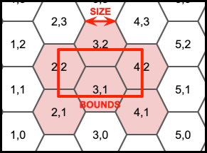

# Drone TM Task Splitter

- A hexagon grid is used to maximise captured imagery per flight,
  while ensuring visual line of sight of the drone.
- PostGIS has a ST_HexagonGrid function built in to aid this.
- The `generate_hexagon_grid.sql` file contains a first attempt at a splitting function.
  - This takes three params: the AOI, a hexagon size, and a buffer.
  - The hexagon size determines the length of each side:
    
  - The buffer determines how much of a buffer should be used to ensure full 
    coverage of the AOI (default 50m).
  - An offset of 75m in each direction is used to determine the shift with the
    minimum number of hexagons (as sometimes they get cut off at the edges).
  - The EPSG 4326 is projected to web mercator to use metres for all inputs.
    This could probably be improved.

## Usage

- Execute the `generate_hexagon_grid.sql` code in your database, to create function
  `generate_hexagon_grid`.
- Pass in the params to generate a grid.
- Either from an existing table:
  `SELECT generate_hexagon_grid((SELECT outline FROM projects LIMIT 1), 100, 50);`
- Or from a text based geojson:
    ```sql
    WITH aoi_geom AS (
        SELECT ST_SetSRID(ST_GeomFromGeoJSON('
            {
                "type": "Polygon",
                "coordinates": [
                    [
                        [85.29998911024427, 27.714008043780694],
                        [85.29998911024427, 27.710892349952076],
                        [85.30478315714117, 27.710892349952076],
                        [85.30478315714117, 27.714008043780694],
                        [85.29998911024427, 27.714008043780694]
                    ]
                ]
            }
        '), 4326) AS geom
    )

    SELECT generate_best_hexagon_grid(geom, 100, 50) AS hexgrid
    FROM aoi_geom;
    ```

> In the long run we will encapsulate the logic in a Python script.
>
> The function should be `CREATE OR REPLACE` on the database, then
> the function called from the Python db driver.

## Future Plans

- Drones often have no-fly zones that we must avoid in our task areas.
- One approach to do this would be to:
  1. Generate the hexgon grid.
  2. Cut out the provided no-fly zone polygons.
  3. For the hexagons that were affected / partially cut, then could be merged
     into surrounding hexagons.
    a. The result would not be perfectly sized hexagon areas, but as close as we can get.
    b. Some hexagon areas may be slightly larger than the provided size.
  